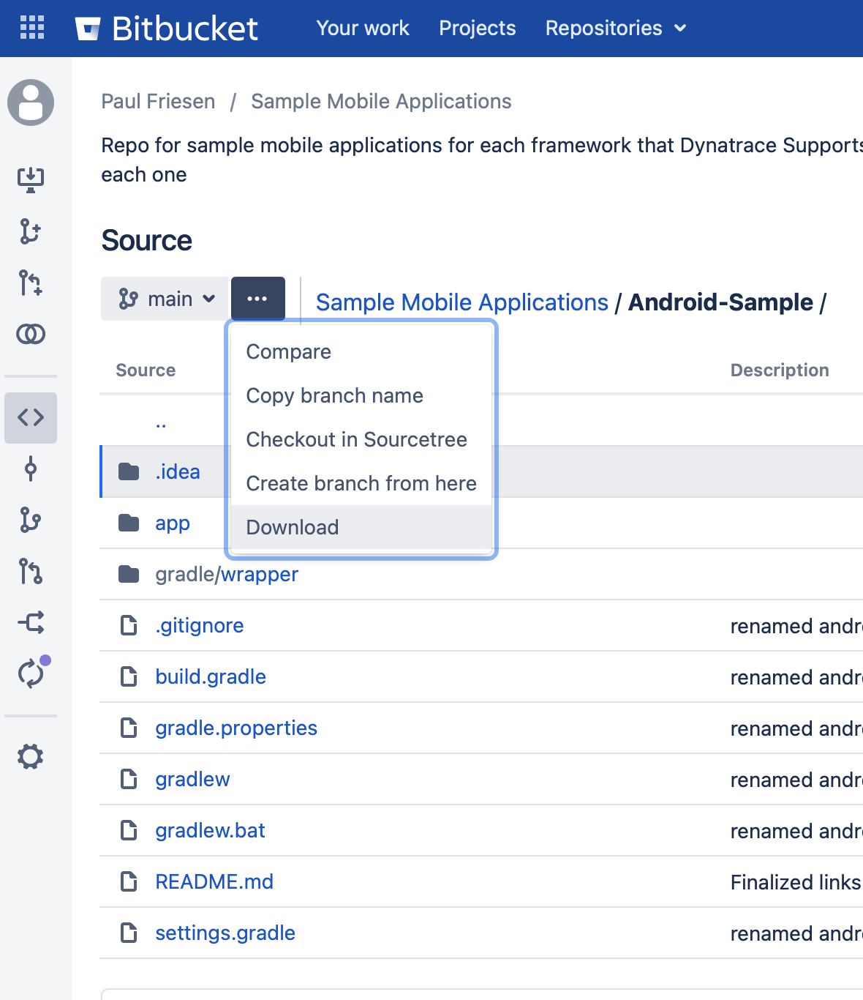
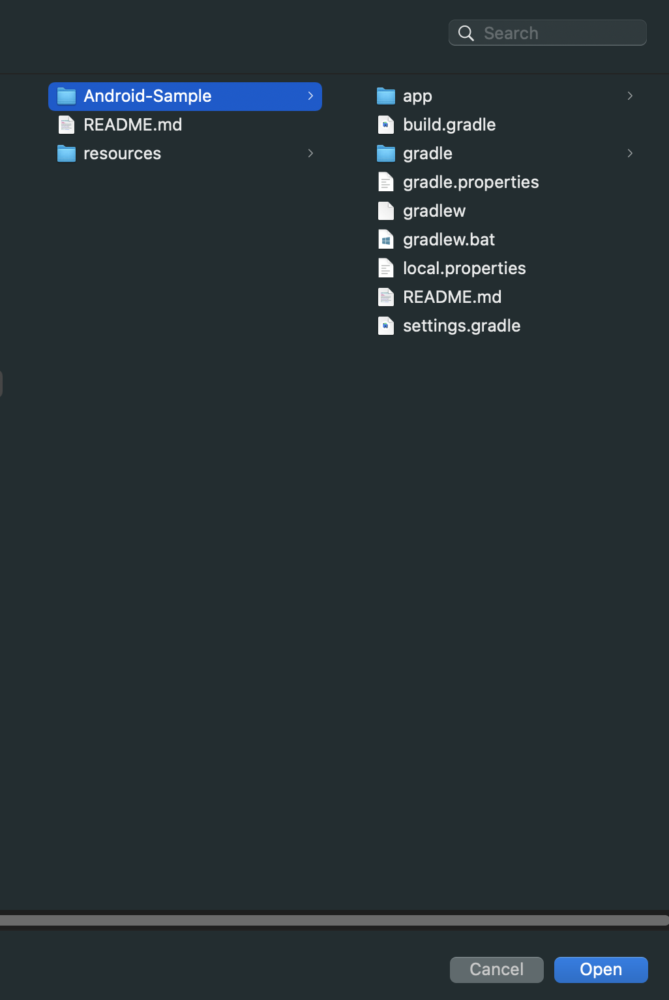
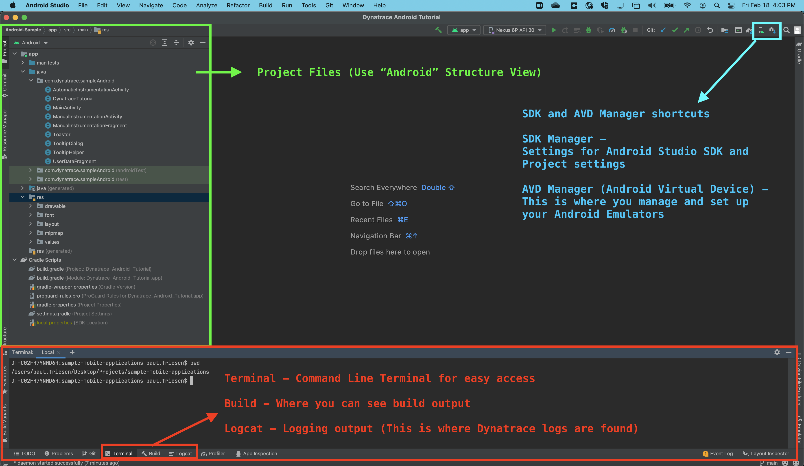
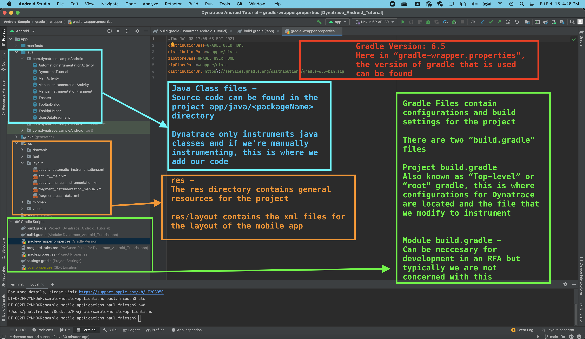
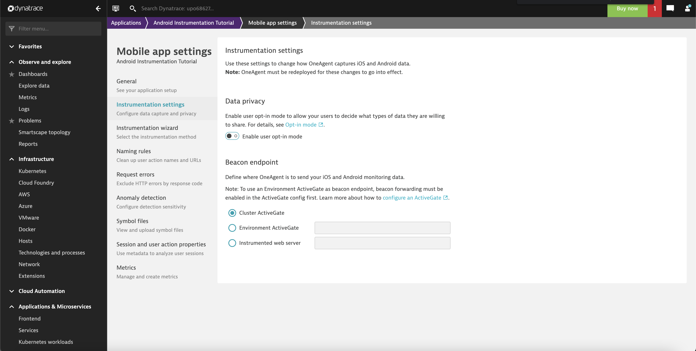
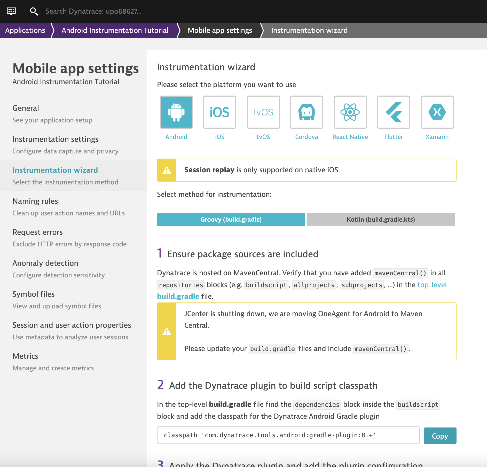
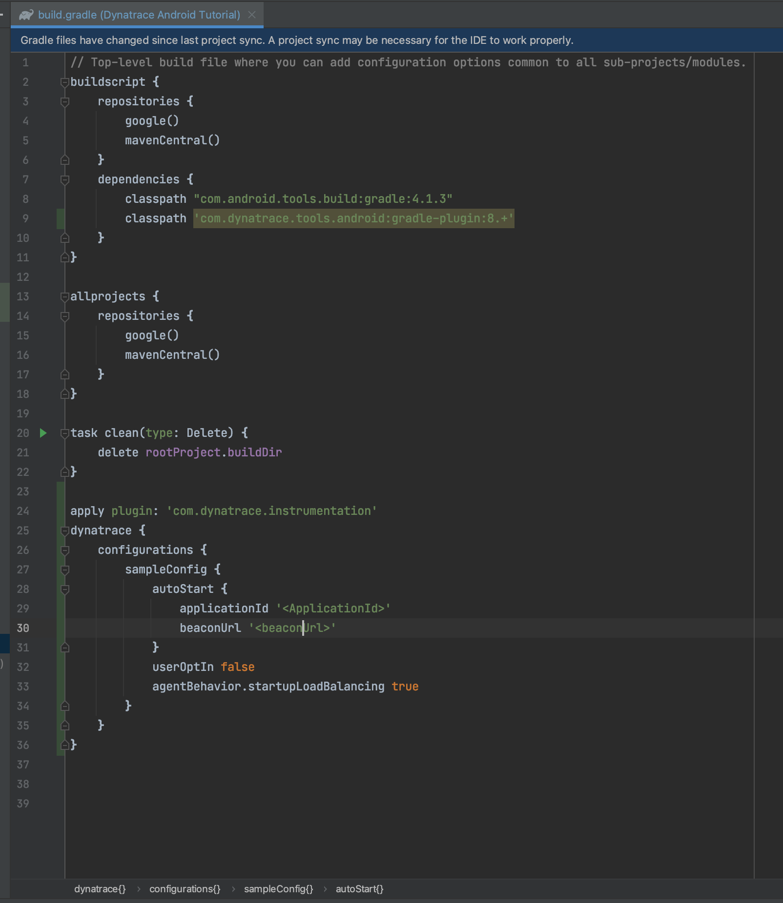

# Android Sample Application Quick-Start guide
Use this README.md guide to download and set up this sample Native Android Application written in Groovy (Java language)

# Table of Contents
- [Android Sample Application Quick-Start guide](#android-sample-application-quick-start-guide)
- [Table of Contents](#table-of-contents)
  - [ Pre-requisites](#-pre-requisites)
  - [ Download and Run Application](#-download-and-run-application)
  - [ Set-up for Automatic Instrumentation](#-set-up-for-automatic-instrumentation)

##  Pre-requisites
- Android Studio Installed
- Emulator Created in Android Studio or Physical Device with USB Debugging enabled

##  Download and Run Application
1. Download the project from bitbucket, save it anywhere on your machine (Note: Emulators cannot be run inside of virtual machines, so make sure you are running from a phyiscal host) 

2. Start Android Studio and select "open" and select the directory containing the gradle files. If you are using windows, you'll see an Android Icon in the project explorer window on the project you want to open 

3. You may be prompted that the project comes from an unknown source, if so, select "trust authors" and let the project load, when it is done, you should be able to set the Project Structure to "Android" 

Here are some descriptions of different files that are mainly worked with in Android projects 

##  Set-up for Automatic Instrumentation
1. Create a Mobile Application in Dynatrace, and once created, disable the UserOptIn toggle 

2. Open the "Instrumentation Wizard" and follow the steps to instrument our project 

Once complete, it should look like this 

3. Run a gradle sync to save the changes to the gradle file and build the application - <b>File > Sync Project with Gradle Files</b> 

